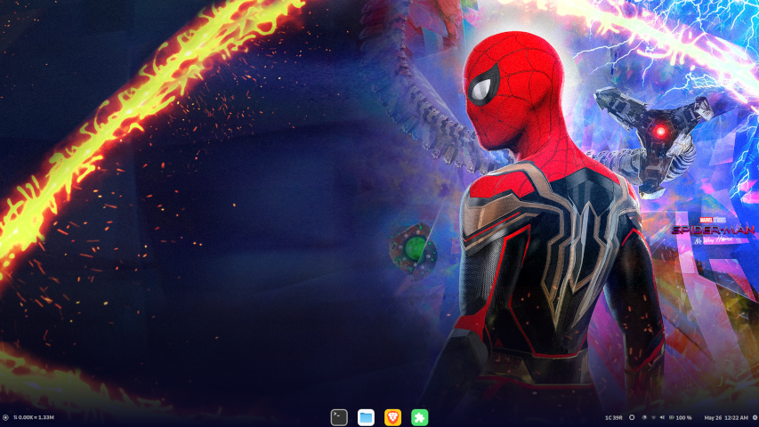

# Wallpaper Overlay

<p align="center">
  
  <br/>
</p>

A Gnome extension to apply overlays on wallpaper.

## Table of Contents

- [Wallpaper Overlay](#wallpaper-overlay)
  - [Table of Contents](#table-of-contents)
  - [Screenshots](#screenshots)
  - [Motivation](#motivation)
  - [Features](#features)
  - [Overlay Creating Guide](#overlay-creating-guide)
  - [Getting Started](#getting-started)
    - [Prerequisite: Install Gnome Tweaks](#prerequisite-install-gnome-tweaks)
    - [Prerequisite: Install Gnome Extensions Manager or Gnome Extensions](#prerequisite-install-gnome-extensions-manager-or-gnome-extensions)
      - [Setting Up Gnome Extensions Manager](#setting-up-gnome-extensions-manager)
      - [Setting Up Gnome Extensions](#setting-up-gnome-extensions)
    - [Prerequisite: Install ImageMagick](#prerequisite-install-imagemagick)
    - [Install Wallpaper Overlay from Gnome Extensions](#install-wallpaper-overlay-from-gnome-extensions)
    - [Install Wallpaper Overlay from source](#install-wallpaper-overlay-from-source)
  - [Contributing](#contributing)
  - [License](#license)
  <!-- - [Thanks to](#thanks-to) -->

## Screenshots

Original                   |  Modified
:-------------------------:|:-------------------------:
  |  

Modified                   |  Modified
:-------------------------:|:-------------------------:
  |  

<p align="center">
  
</p>

<!--  -->


<!-- ## Updates

The new release packs the following new features.
* Better implemented code. -->

## Motivation

I have a habit to change my wallpaper more frequently. And there were some problems I faced on a regular basis:

- I needed to change my dock colour everytime I change my wallpaper so that It may feel consistent with the wallpaper.
- If my dock was transparent then for some wallpapers the color of dock area was so light that the text were barely visible.
- Adding a solid color to dock sometimes gave the feeling that the dock and wallpaper are two separate entities and if I put gradient on the dock then the gradient looked weird as it ranged on the very short heighted dock.
- I made this extension to solve these problems, but while in the making, I realised that It has some potential. Like I can imagine a large set of several innovative overlays which make the Desktop experience more pleasing.

## Features

This extension has following features:

- Visit [Wallpaper Overlay Collection](https://rishuinfinity.github.io/wallpaper-overlays-collection/) to download more custom overlay designs or contribute yours.
- Apply an overlay on wallpaper in four easy steps
  - Choose image : Either take the currently set wallpaper or choose it manually through the file picker
  - Choose overlay : Either choose it from the default drop-down or select a custom svg/png overlay
  - Choose color : Each svg overlay can have one colour that can be modified to the colour you choose here.
  - Click apply and the overlay will be applied and wallpaper will be set.
- You can even apply multiple overlays by:
  - Apply one overlay
  - Reselect current set wallpaper
  - Apply second overlay and so on.
- You can set it to automatically apply your selected overlay whenever wallpaper is changed.
- This extension is also compatible with [Wallpaper Switcher](https://extensions.gnome.org/extension/4812/wallpaper-switcher/) hence it gives a much more smooth experience when using Wallpaper Overlay and Wallpaper Switcher together.

## Overlay Creating Guide

You can create an overlay with your ideas preety easily

- I recommend to copy any overlay file from /src/resources or from [Wallpaper Overlays collection](https://rishuinfinity.github.io/wallpaper-overlays-collection/). Then edit it in any svg editor like inkscape.
- If you want to have the option to change one color, you can set the changeable color to #0000ff. This color in the whole svg gets replaced while applying overlay.
- You can even create a transparent png to use as an overlay.

## Getting Started

To use this extension, you will need

- Gnome 42 or later

### Prerequisite: Install Gnome Tweaks

For Ubuntu,

```bash
sudo add-apt-repository universe
sudo apt install gnome-tweaks
```

For Fedora,

```bash
sudo dnf install gnome-tweaks
```

For Arch Linux,

```bash
sudo pacman -S gnome-tweak-tool
```

You may find Gnome Tweaks for other distributions as well. Install them accordingly.

### Prerequisite: Install Gnome Extensions Manager or Gnome Extensions

I recommend using Gnome Extensinos Manager as it would make your life easier. Gnome Extensions needs few extra steps to be done

#### Setting Up Gnome Extensions Manager

For Ubuntu,

```bash
sudo add-apt-repository universe
sudo apt install gnome-shell-extension-manager
```

For Fedora,

```bash
sudo dnf install gnome-shell-extension-manager
```

For Arch Linux,

```bash
sudo pacman -S gnome-shell-extension-manager
```

You may find Gnome Extension Manager for other distributions as well. Install them accordingly.

#### Setting Up Gnome Extensions

For Ubuntu,

```bash
sudo add-apt-repository universe
sudo apt install gnome-shell-extensions
```

For Fedora,

```bash
sudo dnf install gnome-shell-extensions
```

For Arch Linux,

```bash
sudo pacman -S gnome-shell-extensions
```

You may find Gnome Extension for other distributions as well. Install them accordingly.

After installation, open your browser and go to [Gnome Extension Website](https://extensions.gnome.org)

You would be asked to add a browser extension, install the extension. Now you are ready to install Gnome Extensions.

### Prerequisite: Install ImageMagick

Usually ImageMagick is pre-installed in most of the distros. If not, you will have to install it manually. Visit [ImageMagick website](https://imagemagick.org/script/download.php) to know how to install.

### Install Wallpaper Overlay from Gnome Extensions

If you are using Gnome Extensions Manager then open it and click Browse and search for <b>Wallpaper Overlay</b>

If you are using Gnome Extensions then Visit [Wallpaper Overlay - GNOME Shell Extensions](https://extensions.gnome.org/extension/5082/wallpaper-overlay/)

Now Install it and you are done

### Install Wallpaper Overlay from source

1. Clone this repository

   ```bash
   git clone https://github.com/rishuinfinity/WallpaperOverlay.git
   ```

2. Change current directory to repository

   ```bash
   cd WallpaperOverlay
   ```

3. Now run

   ```bash
   chmod +x ./install.sh && ./install.sh
   ```

4. Hit `ALT + F2`, Type `r` and hit `Enter`

  If you are on Wayland mode, then log out and log in again.
  
5. Open Gnome Extensions/ Gnome Extension Manager

6. Enable Wallpaper Switcher extension

## Contributing

Pull requests are welcome. For major changes, please open an issue first to discuss what you would like to change.

## License

[GNU General Public License v3.0](LICENSE)

Copyright © 2022- [Rishu Raj](https://github.com/rishuinfinity)
